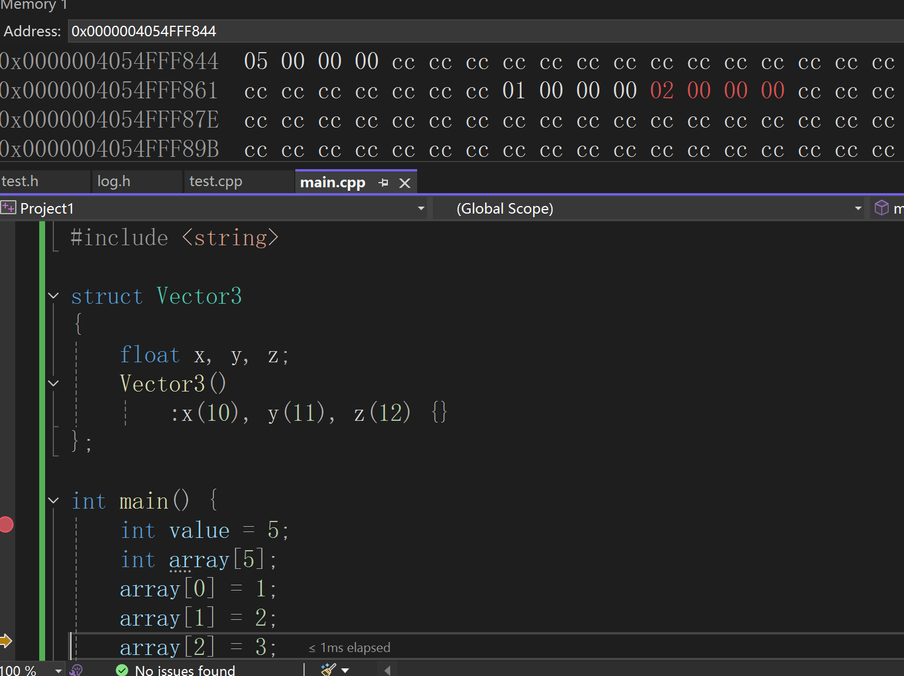

# ELF文件格式简述

#### 说明
本节讨论的格式为ELF文件格式，主要是为了加深了解程序运行时的内存状态。

#### 可重定位的目标文件包含以下内容：
<picture>
  
</picture>


#### 程序虚拟内存的经典布局：

<picture>
  
</picture>

> 虚拟地址空间是操作系统为进程提供的一段虚拟地址的集合，虚拟地址的范围通常从一个较低的地址开始，增长到指令集允许的最大地址。


[Reference1](https://refspecs.linuxbase.org/LSB_3.0.0/LSB-Embedded/LSB-Embedded/specialsections.html#:~:text=)
|
[Reference2](https://www.cnblogs.com/zhcpku/p/14437940.html?utm_source=chatgpt.com)

##### ELF文件中的段包含：
1. .text段
2. .data段，.bss段，.rodata段
3. .rel.text段 .rel.data段
4. .strtab段、.symtab段、.shstrtab段
5. Section Header Table
6. .stack段、.heap段

### 1.text段

.text段为代码段，用于存放指定序。程序加载到内存后，通常为只读，大小固定。

#### 2.data段，bss段，rodata段
**.data段**为数据段，用于存放编译时期就能确定的全局数据，包括**已初始化**的**全局变量**和**静态变量**。加载到内存后，可读可写，大小固定。\
##### 补充：
静态变量包括：静态局部变量和静态全局变量；只要是已初始化的静态变量都会存储在.data段。
```
int i = 3;
char a[] = "Hello World";
static int b = 2023;    // Initialized static global variable
void foo (void) {
  static int c = 2023; // Initialized static local variable
}
```

**.bss段**存储未显示初始化的静态数据，包括变量和常量，不论是全局变量还是局部变量。例如：
```
static int i;
static char a[12];
```
.bss段在可执行文件中占用地址空间，不占用文件空间，通过Section Header记录大小，在加载到内存后再由加载器分配空间并且清零。

**.rodata段**属于常量区(Read-Only Data Section)，存放只读数据，比如字符串常量，全局const变量；加载到内存后，内容只读，大小固定；\
特殊情况：
1. 常数折叠或者直接作为立即数写入指令中，所以不存在常量区
2. 字符串通常在常量区共享一份数据
3. 在某些系统中可能存在.rodata段被多个进程共享的情况（真的吗）

### 3.rel.text段、rel.data段

**.rel.text段**和**rel.data段**分别是针对text段和data段的重定位表；在可执行文件中，如果采用动态链接的方式，可能会保留 **.rel.text段** 和 **.rel.data段**；


### 4.strtab段、.symtab段、.shstrtab段

- **.strtab段**是字符串表，可以存储符号名(st_name)数据，供symtab段关联 \
- **symtab段**是符号表，用于存储变量、函数符号的相关数据，例如符号名称在字符串标的索引、可见范围、数据类型、定义地址等数据\
- **shstrtab段** 也是字符串表，可以存储节名(sh_name)数据，供 ELF 头和节头表通过索引定位各节名称使用 \

### 5. Section Header Table

**节头标(Section Header Table)**是描述ELF文件中各个节的数据结构。节头标通过ELF头的字段指示出其在文件中的偏移和大小，通过节头表可以定位所有节在文件中的位置以及类型等信息。


[Reference1](https://docs.oracle.com/cd/E19455-01/806-3773/elf-2/index.html)|
[Reference2](https://refspecs.linuxbase.org/LSB_3.0.0/LSB-Embedded/LSB-Embedded/specialsections.html#:~:text=)|


### 6. .stack、.heap

堆段包含动态分配的内存，通常从BSS段的末尾开始，并从这里增长到更大地址，直到栈顶


堆栈都是进程中的概念，可执行程序中不包括这两个段。

**栈**内存从高地址向低地址连续分配，在vs2022的debug模式下，每个变量之间存在安全守卫(cc..cc)，栈地址分配从小到大分配，更符合人类直觉，更容易调试。在栈内存回收时，将栈顶指针移回进栈时的位置即可完成整块栈内存的回收。\
\

**堆**内存是的分配在C++中是通过new关键字(new->malloc->查询内存分配表、空闲表等一系列内存分配操作)向操作系统进行动态分配，再通过delete关键字归还内存块。\


#### 栈和堆内存分配的区别

1. 栈内存的分配和回收更加高效
2. 尽可能在栈上分配内存，除非：
   - 生命周期超过函数其作用域/所在作用域范围
   - 需要很大的空间


问题：**堆**内存的分配既然是动态分配的不连续的内存块，为什么又可以从低地址向高地址增长？

> 待补充 优先级五（想要将操作系统+机组+汇编代码进行联系起来，现在都是孤立的模块）

问题：虚拟内存与物理内存的关系？

[Data segment wikipedia](https://en.wikipedia.org/wiki/Data_segment)


